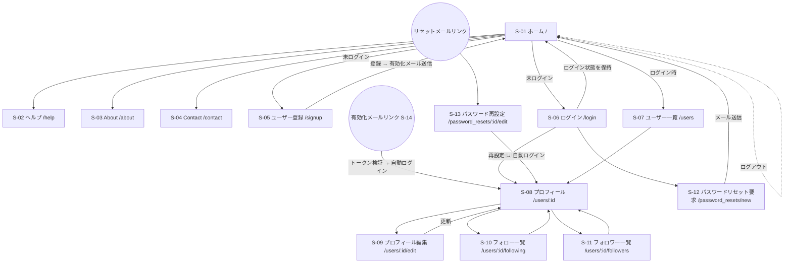

# 基本設計書

## マイクロポストアプリ (rails-micropost-app)

| 項目 | 内容 |
| --- | --- |
| ドキュメント名 | 基本設計書 |
| 対象システム | マイクロブログ + AIテキストモデレーションシステム（rails-micropost-app） |
| バージョン | 2.0 |
| 作成日 | 2026-06-01 |
| ステータス | ドラフト |

> 本書はソースコードの実装内容（ルーティング・コントローラ・モデル・ジョブ・ビュー・設定ファイル等）に基づいて作成しています。
> 詳細な実装仕様は別冊「[詳細設計書](./detailed_design.md)」を、要件は「[要件定義書](./requirements_definition.md)」を参照してください。
> ハードウェア／ネットワーク構成は `config/deploy.yml`（Kamal）の記述に基づく想定構成です（実環境のIP・台数は環境ごとに確定する）。

---

## 0. はじめに

### 0.1 本書の目的

Twitter（X）に類似したマイクロブログ型SNSアプリケーション「マイクロポストアプリ」の基本設計を定義する。システム方式・画面・帳票・バッチ・データ・外部インターフェースの設計概要を示し、開発・保守の指針とする。

### 0.2 用語定義

| 用語 | 説明 |
| --- | --- |
| マイクロポスト (Micropost) | ユーザーが投稿する140文字以内の短文。画像を1枚添付できる |
| フィード (Feed) | ログインユーザー自身とフォロー中ユーザーの投稿を時系列に並べた一覧 |
| フォロー関係 (Relationship) | あるユーザーが別ユーザーをフォローしている状態（自己結合） |
| アカウント有効化 (Account Activation) | 登録時にメールリンクをクリックしてアカウントを利用可能にする手続き |
| モデレーション (Moderation) | 投稿内容をスパム・攻撃性の観点で外部AIにより自動判定する処理 |
| ステータス (status) | スパム判定結果のラベル。`safe`（安全）/ `warning`（注意）/ `danger`（危険） |

### 0.3 技術スタック

| 分類 | 採用技術 |
| --- | --- |
| 言語 | Ruby 3.3.11 |
| フレームワーク | Ruby on Rails 8.1.3 |
| データベース | SQLite 3 |
| 認証 | bcrypt（`has_secure_password`） |
| ページネーション | will_paginate / will_paginate-bootstrap5 |
| 画像処理・保管 | Active Storage + image_processing |
| フロントエンド | Bootstrap 5、Hotwire（Turbo / Stimulus）、Importmap、Propshaft |
| 非同期処理 | Active Job（開発：`:async` / 本番：Solid Queue） |
| リアルタイム通信 | Action Cable / Turbo Streams（開発：`async` / 本番：Solid Cable） |
| キャッシュ | Solid Cache |
| メール送信 | Action Mailer |
| 外部連携 | FastAPIベースのテキストモデレーションAPI |
| テスト | Minitest、Capybara、Selenium |
| セキュリティ検査 | Brakeman、bundler-audit |
| デプロイ | Docker / Kamal、Thruster（アセットキャッシュ・圧縮） |

---

# 機能設計

## 1. システム方式

### 1-1. ハードウェア構成図

本番環境はKamalによるDockerコンテナデプロイを前提とする（`config/deploy.yml`）。単一Webサーバ構成を基本とし、必要に応じてジョブ専用サーバを分離可能。

```
                  ┌─────────────────────────────────┐
                  │           クライアント            │
                  │  PC / スマートフォンのブラウザ      │
                  └────────────────┬────────────────┘
                                   │ HTTPS (443)
                                   ▼
        ┌──────────────────────────────────────────────────┐
        │            Webサーバ（Dockerホスト）               │
        │            例: 192.168.0.1                         │
        │  ┌────────────────────────────────────────────┐  │
        │  │ kamal-proxy（TLS終端 / Let's Encrypt）        │  │
        │  └───────────────────┬────────────────────────┘  │
        │  ┌───────────────────▼────────────────────────┐  │
        │  │ Railsアプリコンテナ                          │  │
        │  │  Thruster + Puma（Webプロセス）              │  │
        │  │  Solid Queue（ジョブワーカー：Puma内 or 別）  │  │
        │  └───────────────────┬────────────────────────┘  │
        │  ┌───────────────────▼────────────────────────┐  │
        │  │ SQLiteデータベースファイル（永続ボリューム）   │  │
        │  │ Active Storage画像ファイル（永続ボリューム）   │  │
        │  └─────────────────────────────────────────────┘  │
        └───────────────────────┬──────────────────────────┘
                                │ HTTP
                                ▼
        ┌──────────────────────────────────────────────────┐
        │   モデレーションAPIサーバ（FastAPI / Uvicorn）      │
        │   既定: 127.0.0.1:8000（同一ホスト想定）            │
        └──────────────────────────────────────────────────┘
```

| サーバ | 役割 | 備考 |
| --- | --- | --- |
| Webサーバ | Railsアプリ・ジョブワーカー・DB・画像ファイルを稼働 | Dockerホスト。`config/deploy.yml`では `web: 192.168.0.1`（例） |
| モデレーションAPIサーバ | テキストモデレーション判定 | 既定で同一ホストの `127.0.0.1:8000`。外部ホストへの分離も可能 |
| 開発環境 | 上記をすべて開発者ローカルマシン1台で稼働 | DB=SQLite、ジョブ=`:async`、Cable=`async` |

> 注：DBにSQLiteを採用しているため、本構成は単一Webサーバを基本とする。Webサーバを水平分割する場合はDB・ストレージの外部化が前提となる。

### 1-2. ソフトウェア構成図

```
┌───────────────────────────── クライアント層 ─────────────────────────────┐
│  ブラウザ（モダンブラウザのみ許可：allow_browser :modern）                  │
│  Bootstrap 5 / Hotwire(Turbo, Stimulus) / Importmap                       │
└───────────────────────────────────────────────────────────────────────────┘
                                   │ HTTPS
┌───────────────────────────── アプリケーション層 ─────────────────────────┐
│  kamal-proxy（TLS終端）                                                    │
│  Thruster（X-Sendfile / 圧縮 / アセットキャッシュ）                         │
│  Puma（アプリサーバ）                                                       │
│  ┌────────────────────────── Ruby on Rails 8.1 ────────────────────────┐ │
│  │  Action Controller / Action View（MVC）                              │ │
│  │  Action Mailer（メール送信）                                          │ │
│  │  Active Job → Solid Queue（非同期ジョブ）                             │ │
│  │  Action Cable → Solid Cable（Turbo Streams配信）                      │ │
│  │  Active Record / Active Storage                                      │ │
│  │  Solid Cache（キャッシュ）                                            │ │
│  └──────────────────────────────────────────────────────────────────────┘ │
└───────────────────────────────────────────────────────────────────────────┘
                                   │
┌───────────────────────────── データ層 ───────────────────────────────────┐
│  SQLite（primary / queue / cache / cable）                                 │
│  Active Storage（ローカルディスク：画像ファイル）                           │
└───────────────────────────────────────────────────────────────────────────┘
                                   │ HTTP
┌───────────────────────────── 外部サービス層 ─────────────────────────────┐
│  テキストモデレーションAPI（FastAPI / Uvicorn）                            │
└───────────────────────────────────────────────────────────────────────────┘
```

### 1-3. ネットワーク構成図

```
        Internet
           │
           │ HTTPS/443（Let's Encrypt証明書）
           ▼
   ┌──────────────────┐
   │  kamal-proxy      │  ← TLS終端・リバースプロキシ
   └────────┬─────────┘
            │ HTTP（コンテナ内・ローカル）
            ▼
   ┌──────────────────┐
   │ Rails(Puma/Thruster) │
   └───┬─────────┬────┘
       │         │ HTTP/8000（ループバック or 内部ネットワーク）
       │         ▼
       │   ┌──────────────────┐
       │   │ FastAPI 127.0.0.1│
       │   └──────────────────┘
       ▼
   ┌──────────────────┐    ┌──────────────────┐
   │ SQLite(file I/O) │    │ SMTP（メール配信） │
   └──────────────────┘    └──────────────────┘
```

| 通信経路 | プロトコル / ポート | 用途 |
| --- | --- | --- |
| ブラウザ ↔ kamal-proxy | HTTPS / 443 | 画面表示・操作・Turbo Streams（WebSocket over TLS） |
| Rails ↔ FastAPI | HTTP / 8000 | モデレーション判定リクエスト |
| Rails ↔ SQLite | ファイルI/O | データ永続化 |
| Rails ↔ SMTP | SMTP | 有効化・パスワードリセットメール送信 |

### 1-4. アプリケーション機能構成図

```
マイクロポストアプリ
├─ 静的ページ機能（StaticPages）
│   ├─ ホーム（未ログイン紹介 / ログイン時ダッシュボード）
│   └─ ヘルプ / About / Contact
├─ アカウント機能
│   ├─ ユーザー登録（Users#new/create）
│   ├─ アカウント有効化（AccountActivations）
│   ├─ ログイン / ログアウト / ログイン保持（Sessions）
│   └─ パスワードリセット（PasswordResets）
├─ ユーザー管理機能（Users）
│   ├─ プロフィール表示 / 編集
│   ├─ ユーザー一覧
│   └─ ユーザー削除（管理者）
├─ 投稿機能（Microposts）
│   ├─ 投稿作成（テキスト + 画像）
│   ├─ 投稿削除
│   └─ フィード表示（StaticPages#home）
├─ フォロー機能（Relationships）
│   ├─ フォロー / フォロー解除
│   └─ フォロー / フォロワー一覧（Users#following/followers）
├─ モデレーション機能（非同期）
│   ├─ ModerationJob（ジョブ制御）
│   ├─ TextModerationApi / FastapiClient（API連携）
│   └─ 判定結果のリアルタイム表示（Turbo Streams）
└─ 共通基盤
    ├─ 認証・認可（SessionsHelper / before_action）
    ├─ 国際化（i18n：ja / en）
    └─ メール送信（UserMailer）
```

---

## 2. 画面設計

### 2-1. 画面一覧

| 画面ID | 画面名 | URL | HTTPメソッド | コントローラ#アクション | ログイン要否 |
| --- | --- | --- | --- | --- | --- |
| S-01 | ホーム | `/` | GET | static_pages#home | 不要 |
| S-02 | ヘルプ | `/help` | GET | static_pages#help | 不要 |
| S-03 | About | `/about` | GET | static_pages#about | 不要 |
| S-04 | Contact | `/contact` | GET | static_pages#contact | 不要 |
| S-05 | ユーザー登録 | `/signup` | GET | users#new | 不要 |
| S-06 | ログイン | `/login` | GET | sessions#new | 不要 |
| S-07 | ユーザー一覧 | `/users` | GET | users#index | 必要 |
| S-08 | プロフィール | `/users/:id` | GET | users#show | 不要（有効化済みのみ） |
| S-09 | プロフィール編集 | `/users/:id/edit` | GET | users#edit | 必要（本人） |
| S-10 | フォロー一覧 | `/users/:id/following` | GET | users#following | 必要 |
| S-11 | フォロワー一覧 | `/users/:id/followers` | GET | users#followers | 必要 |
| S-12 | パスワードリセット要求 | `/password_resets/new` | GET | password_resets#new | 不要 |
| S-13 | パスワード再設定 | `/password_resets/:id/edit` | GET | password_resets#edit | 不要（トークン検証） |
| S-14 | アカウント有効化 | `/account_activations/:id/edit` | GET | account_activations#edit | 不要（トークン検証・遷移のみ） |

> S-14はメールリンク経由の処理用エンドポイントで、独自の画面は持たず処理後にプロフィールまたはホームへリダイレクトする。

### 2-2. 画面遷移図



> 注：丸ノードはメール内リンク経由の遷移。投稿の作成・削除、フォロー/フォロー解除は画面遷移を伴わず、Turboによる部分更新でホーム／プロフィール上で完結する。

### 2-3. 画面レイアウト

全画面共通でヘッダー（ナビゲーションバー）・フラッシュメッセージ領域・フッターを表示する。

**共通レイアウト**

```
┌──────────────────────────────────────────────────────────┐
│ [sample app] Home  Help        Users  Account ▾ (ログイン時)│  ← ヘッダー
├──────────────────────────────────────────────────────────┤
│ [フラッシュメッセージ：success / info / warning / danger]   │
├──────────────────────────────────────────────────────────┤
│                                                            │
│                    （各画面のコンテンツ）                    │
│                                                            │
├──────────────────────────────────────────────────────────┤
│ The Ruby on Rails Tutorial / About / Contact               │  ← フッター
└──────────────────────────────────────────────────────────┘
```

**S-01 ホーム（ログイン時ダッシュボード）**

```
┌───────────────────────┬────────────────────────────────────┐
│ [Gravatar] ユーザー名   │  Micropost Feed                    │
│ プロフィールへ           │  ┌────────────────────────────┐   │
│                        │  │[icon] 名前                  │   │
│ microposts: N          │  │ 本文テキスト                 │   │
│ following:N followers:M │  │ [画像]                      │   │
│                        │  │ 3分前  [判定ステータス] delete│   │
│ ┌───────────────────┐  │  └────────────────────────────┘   │
│ │ 投稿フォーム        │  │  ┌────────────────────────────┐   │
│ │ [テキストエリア]    │  │  │ ... （以降の投稿）           │   │
│ │ [画像選択] [Post]   │  │  └────────────────────────────┘   │
│ └───────────────────┘  │  [ページネーション]                 │
└───────────────────────┴────────────────────────────────────┘
```

判定ステータス領域（`#status-<id>`）はTurbo Streamsで差し替えられ、以下のいずれかを表示する。

```
判定中：  [⏳ スピナー] スパム判定中... / 怒り判定中...
完了時：  ✅安全 / ⚠️注意 / 🚨危険 （スパム度：xx.x %）
          ⚠️至急対応  理由：xxx   または   ✅怒っていません  理由：xxx
```

**S-05 ユーザー登録 / S-06 ログイン（フォーム系）**

```
┌────────────────────────────┐    ┌────────────────────────────┐
│ Sign up                     │    │ Log in                      │
│ Name      [____________]    │    │ Email     [____________]    │
│ Email     [____________]    │    │ Password  [____________]    │
│ Password  [____________]    │    │ [ ] Remember me on this...  │
│ Confirm   [____________]    │    │ [ Log in ]                  │
│ [ Create my account ]       │    │ New user? Sign up now!      │
└────────────────────────────┘    │ (forgot password? リンク)   │
                                   └────────────────────────────┘
```

**S-08 プロフィール**

```
┌───────────────────────┬────────────────────────────────────┐
│ [Gravatar] ユーザー名   │  Microposts (N)                    │
│ following:N followers:M │  ┌────────────────────────────┐   │
│ [Follow / Unfollow]ボタン│  │ 当該ユーザーの投稿一覧        │   │
│ （他ユーザー閲覧時）      │  │ ...                         │   │
│                        │  └────────────────────────────┘   │
│                        │  [ページネーション]                 │
└───────────────────────┴────────────────────────────────────┘
```

### 2-4. 画面入出力項目一覧

| 画面ID | 入力項目 | 出力項目 |
| --- | --- | --- |
| S-01（未ログイン） | なし | サービス紹介、Sign up / Log inリンク |
| S-01（ログイン） | 投稿本文(content)、画像(picture) | ユーザー情報、フォロー/フォロワー数、投稿数、フィード一覧、各投稿の判定ステータス |
| S-05 ユーザー登録 | name, email, password, password_confirmation | バリデーションエラー、登録結果フラッシュ |
| S-06 ログイン | email, password, remember_me | 認証結果フラッシュ |
| S-07 ユーザー一覧 | ページ番号(page) | 有効化済みユーザー一覧、ページネーション |
| S-08 プロフィール | ページ番号(page) | ユーザー情報、フォロー/フォロワー数、投稿一覧、フォロー/解除ボタン |
| S-09 プロフィール編集 | name, email, password, password_confirmation | 更新結果フラッシュ、エラー |
| S-10/S-11 フォロー・フォロワー一覧 | ページ番号(page) | ユーザー一覧、統計サイドバー |
| S-12 パスワードリセット要求 | email | 送信結果フラッシュ |
| S-13 パスワード再設定 | password, password_confirmation | 再設定結果フラッシュ、エラー |

### 2-5. 画面アクション定義

| 画面ID | アクション（操作） | トリガ | 処理 / 遷移先 |
| --- | --- | --- | --- |
| S-01 | 投稿する | [Post]ボタン | microposts#create → 投稿保存・ModerationJob起動 → `/`へリダイレクト |
| S-01/S-08 | 投稿削除 | [delete]リンク（確認ダイアログ） | microposts#destroy（DELETE）→ 元ページへ戻る（Turbo） |
| S-05 | アカウント作成 | [Create my account] | users#create → 有効化メール送信 → `/`へ |
| S-06 | ログイン | [Log in] | sessions#create → 認証・有効化確認 → 元ページ or プロフィール |
| 共通 | ログアウト | アカウントメニュー[Log out]（DELETE） | sessions#destroy → `/`へ |
| S-08 | フォロー / 解除 | [Follow]/[Unfollow]ボタン | relationships#create/destroy → プロフィールへ（Turbo部分更新） |
| S-09 | プロフィール更新 | [Save changes] | users#update → プロフィールへ |
| S-07/S-08 | 管理者によるユーザー削除 | [delete]リンク（管理者のみ） | users#destroy → ユーザー一覧へ |
| S-12 | リセット要求 | [Submit] | password_resets#create → リセットメール送信 → `/`へ |
| S-13 | パスワード再設定 | [Update password] | password_resets#update → 自動ログイン → プロフィールへ |
| 全画面 | 判定ステータス更新 | ModerationJobからのブロードキャスト | Turbo Streamsで`#status-<id>`を差し替え（操作不要・自動） |

---

## 3. 帳票設計

### 3-1. 帳票一覧

**該当なし。** 本システムは帳票（PDF・CSV・印刷出力等）を持たない。すべての情報出力はWeb画面表示およびメール通知で行う。

### 3-2. 帳票概要

該当なし。

### 3-3. 帳票レイアウト

該当なし。

### 3-4. 帳票出力項目一覧

該当なし。

### 3-5. 帳票編集定義

該当なし。

> 参考：ユーザーへの定型通知としてメール（アカウント有効化メール・パスワードリセットメール）を送信するが、これらは帳票ではなく「6. 外部インターフェース設計」および本書のメール定義で扱う。

---

## 4. バッチ設計

本システムには対話操作と独立して動作する処理として、(a) 投稿時にイベント駆動で起動する非同期ジョブ、(b) スケジュール起動の定期ジョブ、の2種類が存在する。

### 4-1. バッチ処理一覧

| ID | 処理名 | 種別 | 起動契機 | 実行基盤 |
| --- | --- | --- | --- | --- |
| B-01 | モデレーションジョブ（ModerationJob） | イベント駆動・非同期 | 投稿作成成功時に `perform_later` で起動 | Active Job（開発:async / 本番:Solid Queue） |
| B-02 | 完了ジョブクリーンアップ | 定期スケジュール | 毎時12分（`config/recurring.yml`） | Solid Queue（本番のみ） |

### 4-2. バッチ処理フロー

**B-01 ModerationJob**

```
[投稿保存成功] → ModerationJob.perform_later(micropost_id)
        │
        ▼
  processing_state = processing に更新 → Turbo Streamsで「判定中」表示
        │
        ▼
  スパム判定API（/predict）呼び出し
        │  → spam_score, status を更新 → ブロードキャスト
        ▼
  怒り判定API（/angry）呼び出し
        │  → is_angry, angry_score, reason, summary を更新
        ▼
  processing_state = done に更新 → 最終結果をブロードキャスト
        │
        └─（例外発生時）→ processing_state = failed に更新し例外を再送出
```

**B-02 完了ジョブクリーンアップ**

```
[毎時12分] → SolidQueue::Job.clear_finished_in_batches(sleep_between_batches: 0.3)
        → Solid Queueの完了済みジョブをバッチ削除
```

### 4-3. バッチ処理定義

| 項目 | B-01 ModerationJob | B-02 完了ジョブクリーンアップ |
| --- | --- | --- |
| キュー | default | （Solid Queue内部） |
| 引数 | micropost_id | sleep_between_batches: 0.3 |
| 入力 | 対象Micropostのcontent | Solid Queueの完了ジョブ |
| 外部呼び出し | TextModerationApi.check(:spam / :angry) | なし |
| 更新対象 | microposts（processing_state, spam_score, status, is_angry, angry_score, reason, summary） | solid_queueジョブテーブル |
| 結果通知 | Turbo::StreamsChannel.broadcast_replace_to("microposts", target: "status-<id>") | なし |
| 異常処理 | rescueで processing_state=failed に更新後、例外を再送出 | Solid Queue標準 |
| スケジュール | 投稿のたびに即時 | 毎時12分（本番環境のみ） |

---

## 5. テーブル・ファイル要件

### 5-1. テーブル関連図

```
                    ┌──────────────────────┐
                    │        users         │
                    │ PK id                │
                    └───┬──────────────┬───┘
            1           │              │           1
       ┌────────────────┘              └────────────────┐
       │ N (user_id)                          N          │ N
       ▼                            (follower_id /        ▼
┌──────────────┐                     followed_id) ┌──────────────────┐
│  microposts  │                                  │  relationships   │
│ PK id        │                                  │ PK id            │
│ FK user_id   │                                  │ FK follower_id   │
└──────┬───────┘                                  │ FK followed_id   │
       │ 1                                         └──────────────────┘
       ▼ 0..1                                       （usersへの自己結合）
┌───────────────────────────────┐
│ active_storage_attachments    │
│  └ active_storage_blobs       │  ← 投稿画像（picture）
│     └ active_storage_variant_records │
└───────────────────────────────┘
```

### 5-2. テーブル・ファイル一覧

| 種別 | 名称 | 概要 |
| --- | --- | --- |
| テーブル | users | ユーザー情報・認証情報 |
| テーブル | microposts | 投稿とモデレーション結果 |
| テーブル | relationships | フォロー関係（usersの自己結合） |
| テーブル | active_storage_blobs | 添付ファイルの実体メタ情報 |
| テーブル | active_storage_attachments | レコードと添付ファイルの関連 |
| テーブル | active_storage_variant_records | 画像バリアント情報 |
| ファイル | Active Storage格納画像 | 投稿画像の実ファイル（ローカルディスク） |
| 設定ファイル | config/locales/ja.yml, en.yml | 画面文言・メッセージ（i18n） |

### 5-3. テーブル・ファイル定義

**users**

| カラム | 型 | NULL | 既定 | 制約・説明 |
| --- | --- | --- | --- | --- |
| id | bigint | × | | 主キー |
| name | string | ○ | | 必須・最大50文字（モデル検証） |
| email | string | ○ | | 必須・最大255文字・形式検証・一意・小文字化保存 |
| password_digest | string | ○ | | bcryptハッシュ |
| activation_digest | string | ○ | | 有効化トークンのダイジェスト |
| activated | boolean | ○ | false | 有効化済みフラグ |
| activated_at | datetime | ○ | | 有効化日時 |
| admin | boolean | ○ | false | 管理者フラグ |
| remember_digest | string | ○ | | ログイン保持トークンのダイジェスト |
| reset_digest | string | ○ | | パスワードリセットトークンのダイジェスト |
| reset_sent_at | datetime | ○ | | リセットメール送信日時 |
| created_at / updated_at | datetime | × | | 作成・更新日時 |

索引：`email`（ユニーク）

**microposts**

| カラム | 型 | NULL | 既定 | 制約・説明 |
| --- | --- | --- | --- | --- |
| id | bigint | × | | 主キー |
| content | text | ○ | | 必須・最大140文字（モデル検証） |
| user_id | integer | × | | 投稿者（FK → users） |
| processing_state | integer | × | 0 | enum: pending(0)/processing(1)/done(2)/failed(3) |
| spam_score | float | ○ | | スパム度スコア |
| status | string | ○ | "safe" | スパム判定ラベル（safe/warning/danger） |
| is_angry | boolean | × | false | 怒り/有害性フラグ |
| angry_score | float | ○ | | 怒りスコア |
| reason | text | ○ | | 判定理由 |
| summary | text | ○ | | 投稿内容の要約 |
| created_at / updated_at | datetime | × | | 既定で created_at 降順表示 |

索引：`user_id`、`(user_id, created_at)`　外部キー：user_id → users

**relationships**

| カラム | 型 | NULL | 既定 | 制約・説明 |
| --- | --- | --- | --- | --- |
| id | bigint | × | | 主キー |
| follower_id | integer | ○ | | フォローする側（必須・モデル検証） |
| followed_id | integer | ○ | | フォローされる側（必須・モデル検証） |
| created_at / updated_at | datetime | × | | |

索引：`follower_id`、`followed_id`、`(follower_id, followed_id)`（ユニーク）

**active_storage_*（Rails標準）**

| テーブル | 主な項目 |
| --- | --- |
| active_storage_blobs | key, filename, content_type, byte_size, checksum, service_name |
| active_storage_attachments | name, record_type, record_id, blob_id |
| active_storage_variant_records | blob_id, variation_digest |

### 5-4. CRUD図

機能（コントローラ#アクション / ジョブ）と主要テーブルのCRUD対応。C=作成 R=参照 U=更新 D=削除

| 機能 | users | microposts | relationships | active_storage |
| --- | :---: | :---: | :---: | :---: |
| users#create（登録） | C | | | |
| users#show（プロフィール） | R | R | | R |
| users#edit/update | R | | | |
| users#index（一覧） | R | | | |
| users#destroy（管理者） | D | (D) | (D) | (D) |
| sessions#create（ログイン） | R / U(remember) | | | |
| sessions#destroy（ログアウト） | U(remember) | | | |
| account_activations#edit | R / U | | | |
| password_resets#create | R / U | | | |
| password_resets#update | R / U | | | |
| microposts#create（投稿） | | C | | C |
| microposts#destroy（削除） | | D | | D |
| ModerationJob（B-01） | | R / U | | |
| relationships#create（フォロー） | | | C | |
| relationships#destroy（解除） | | | D | |
| static_pages#home（フィード） | R | R | R | R |

> users#destroyの (D) は `dependent: :destroy` による関連レコードの連鎖削除。

---

## 6. 外部インターフェース設計

### 6-1. 外部システム関連図

```
┌──────────────────────┐                       ┌────────────────────────────┐
│  Railsアプリ          │  ① POST /predict      │  テキストモデレーションAPI    │
│  （ModerationJob）     │ ────────────────────▶ │  （FastAPI）                 │
│                      │  ② POST /angry        │  base: http://127.0.0.1:8000 │
│                      │ ────────────────────▶ │                            │
│                      │ ◀──────────────────── │                            │
└──────────┬───────────┘   JSONレスポンス        └────────────────────────────┘
           │ ③ メール送信（Action Mailer）
           ▼
┌──────────────────────┐
│  SMTPサーバ           │ ──▶ 利用者（有効化メール / パスワードリセットメール）
└──────────────────────┘
```

### 6-2. 外部インターフェース一覧

| ID | インターフェース名 | 相手システム | 方向 | プロトコル | 契機 |
| --- | --- | --- | --- | --- | --- |
| IF-01 | スパム判定 | モデレーションAPI(FastAPI) | 送信→受信 | HTTP POST / JSON | 投稿作成時（ModerationJob） |
| IF-02 | 怒り/有害性判定 | モデレーションAPI(FastAPI) | 送信→受信 | HTTP POST / JSON | 投稿作成時（ModerationJob） |
| IF-03 | アカウント有効化メール | SMTP | 送信 | SMTP | ユーザー登録時 |
| IF-04 | パスワードリセットメール | SMTP | 送信 | SMTP | リセット要求時 |

### 6-3. 外部インターフェース定義書

**IF-01 スパム判定**

| 項目 | 内容 |
| --- | --- |
| エンドポイント | `POST {BASE_URL}/predict`（BASE_URL=`http://127.0.0.1:8000`） |
| リクエストヘッダ | Content-Type: application/json / Accept: application/json |
| リクエストボディ | `{ "text": "<投稿本文>" }` |
| レスポンスボディ | `{ "score": <float>, "label": "<safe/warning/danger>" }` |
| マッピング | score → microposts.spam_score、label → microposts.status |

**IF-02 怒り/有害性判定**

| 項目 | 内容 |
| --- | --- |
| エンドポイント | `POST {BASE_URL}/angry` |
| リクエストヘッダ | Content-Type: application/json / Accept: application/json |
| リクエストボディ | `{ "text": "<投稿本文>" }` |
| レスポンスボディ | `{ "moderation": { "is_angry": <bool>, "score": <float>, "reason": "<text>" }, "summary": "<text>" }` |
| マッピング | is_angry→is_angry、score→angry_score、reason→reason、summary→summary |

**IF-03 アカウント有効化メール / IF-04 パスワードリセットメール**

| 項目 | IF-03 | IF-04 |
| --- | --- | --- |
| 送信元 | UserMailer#account_activation | UserMailer#password_reset |
| 宛先 | 登録ユーザーのメールアドレス | 要求ユーザーのメールアドレス |
| 本文 | 有効化リンク（トークン付き） | 再設定リンク（トークン付き） |
| 有効期限 | （即時利用想定） | 発行後2時間 |

### 6-4. 外部インターフェース処理概要

**モデレーションAPI（IF-01 / IF-02）**

- 呼び出しは `FastapiClient.request(path, payload)`（`Net::HTTP` でPOST）が担い、`TextModerationApi.check(type, text)` がエンドポイントの振り分け（`:spam`→`/predict`、`:angry`→`/angry`）とJSONパースを行う。
- ModerationJob内でスパム判定→怒り判定の順に同期的に呼び出し、各結果でMicropostを更新する。
- 通信・解析で例外が発生した場合、ジョブは `processing_state=failed` に更新し例外を再送出する（投稿自体は保持される）。
- 判定結果は `status` により表示制御に利用され、`danger` の投稿は投稿者本人・管理者以外のフィードに表示されない（`visible_to_user?`）。

**メール送信（IF-03 / IF-04）**

- Action Mailer（`UserMailer`）が有効化・リセットの各メールを生成・送信する。
- トークンはダイジェスト化してDBに保存し、メール本文には生トークンを含むリンクを記載する。リンクアクセス時にトークンを照合する。

---

## 7. 関連ドキュメント

- [要件定義書](./requirements_definition.md)
- [詳細設計書](./detailed_design.md)
- [DB設計書](./database_design.md)
