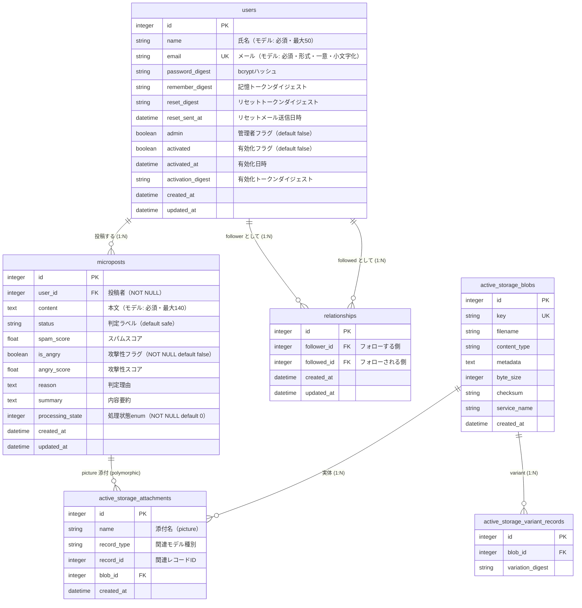
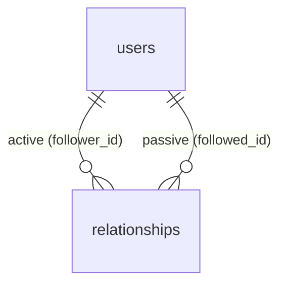

# DB設計書

## マイクロポストアプリ (rails-micropost-app)

| 項目 | 内容 |
| --- | --- |
| ドキュメント名 | DB設計書 |
| 対象システム | マイクロブログ + AIテキストモデレーションシステム（rails-micropost-app） |
| バージョン | 1.0 |
| 作成日 | 2026-06-01 |
| ステータス | ドラフト |

> 本書は `db/schema.rb`（schema version: 2026_05_11_085706）および各モデル（`app/models/*.rb`）の実装に基づいて作成しています。
> DBMSは開発・本番ともに **SQLite 3** を採用しています（Rails 8 標準構成 / Active Record）。
> 関連する設計は「[基本設計書](./basic_design.md)」「[詳細設計書](./detailed_design.md)」を参照してください。

---

## 1. はじめに

### 1.1 本書の目的

本アプリケーションが使用するデータベースの論理・物理設計を定義する。ER図、テーブル定義、カラム定義、インデックス、制約、列挙型（enum）を示し、DB構築・保守の指針とする。

### 1.2 設計方針

- スキーマは Active Record マイグレーションで管理し、`db/schema.rb` を正本とする。
- **DB制約（NOT NULL・UNIQUE・外部キー）** と **アプリケーション制約（モデルのバリデーション）** は別物として整理する。本書では両者を区別して記載する（第3章の各テーブル定義の「補足」を参照）。
- 主キーは Rails 標準の `id`（integer / AUTOINCREMENT）を全テーブルに採用する。
- タイムスタンプ（`created_at` / `updated_at`）は Active Record の規約に従い自動管理する。

### 1.3 DBMS情報

| 項目 | 内容 |
| --- | --- |
| DBMS | SQLite 3 |
| 文字エンコーディング | UTF-8 |
| 主キー | integer 型 `id`（自動採番） |
| 論理削除 | なし（物理削除のみ） |
| スキーマバージョン | 2026_05_11_085706 |

---

## 2. ER図

### 2.1 全体ER図

アプリケーション本体の業務テーブルと、画像保管用の Active Storage テーブル群を示す。

### 2.2 フォロー関係（自己参照）の補足

`relationships` は `users` に対する **自己参照の多対多** を実現する中間テーブルである。`User` モデルでは `has_many :through` により次のように展開される。

- `following`  : 自分が `follower` である `relationships` を介した `followed` ユーザー群
- `followers`  : 自分が `followed` である `relationships` を介した `follower` ユーザー群

---

## 3. テーブル定義

### 3.1 テーブル一覧

| No. | 物理テーブル名 | 論理名 | 用途 | 区分 |
| --- | --- | --- | --- | --- |
| 1 | `users` | ユーザー | アカウント情報・認証情報 | 業務 |
| 2 | `microposts` | マイクロポスト | 投稿本文・モデレーション結果 | 業務 |
| 3 | `relationships` | フォロー関係 | ユーザー間のフォロー（自己結合） | 業務 |
| 4 | `active_storage_blobs` | 添付ファイル実体 | 画像ファイルのメタ情報 | 基盤（Active Storage） |
| 5 | `active_storage_attachments` | 添付関連 | レコードとblobの関連 | 基盤（Active Storage） |
| 6 | `active_storage_variant_records` | バリアント | 画像変換版の管理 | 基盤（Active Storage） |

---

### 3.2 users（ユーザー）

ユーザーのアカウント情報および認証・有効化・パスワードリセットに関する情報を保持する。

| No. | カラム名 | 型 | NOT NULL | 既定値 | キー | 説明 |
| --- | --- | --- | --- | --- | --- | --- |
| 1 | `id` | integer | ○ | 自動採番 | PK | 主キー |
| 2 | `name` | string | - | - | | 氏名 |
| 3 | `email` | string | - | - | UK | メールアドレス |
| 4 | `password_digest` | string | - | - | | パスワードのbcryptハッシュ |
| 5 | `remember_digest` | string | - | - | | 記憶トークン（永続ログイン）のダイジェスト |
| 6 | `reset_digest` | string | - | - | | パスワードリセットトークンのダイジェスト |
| 7 | `reset_sent_at` | datetime | - | - | | リセットメール送信日時 |
| 8 | `admin` | boolean | - | `false` | | 管理者フラグ |
| 9 | `activated` | boolean | - | `false` | | アカウント有効化フラグ |
| 10 | `activated_at` | datetime | - | - | | 有効化日時 |
| 11 | `activation_digest` | string | - | - | | 有効化トークンのダイジェスト |
| 12 | `created_at` | datetime | ○ | - | | 作成日時 |
| 13 | `updated_at` | datetime | ○ | - | | 更新日時 |

**インデックス**

| インデックス名 | 対象カラム | 一意 |
| --- | --- | --- |
| `index_users_on_email` | `email` | ○ |

**補足（DB制約とアプリケーション制約の差異）**

- `name`・`email` はDBレベルではNULLを許容するが、`User` モデルで以下のバリデーションを課している。
  - `name`: 存在必須、最大50文字
  - `email`: 存在必須、最大255文字、形式チェック、**大文字小文字を区別しない一意性**、保存前に小文字化（`before_save :downcase_email`）
- `password_digest` は `has_secure_password` により生成。`password` は最小6文字・`allow_nil: true`。
- `email` の一意性はDBの一意インデックスとモデルバリデーションの二重で担保。
- 各 `*_digest` 列は bcrypt ダイジェストを格納し、生のトークンはDBに保存しない（仮想属性 `remember_token` / `activation_token` / `reset_token` をメモリ上でのみ保持）。

---

### 3.3 microposts（マイクロポスト）

ユーザーの投稿本文と、外部AIによるモデレーション判定結果を保持する。

| No. | カラム名 | 型 | NOT NULL | 既定値 | キー | 説明 |
| --- | --- | --- | --- | --- | --- | --- |
| 1 | `id` | integer | ○ | 自動採番 | PK | 主キー |
| 2 | `user_id` | integer | ○ | - | FK | 投稿者（`users.id`） |
| 3 | `content` | text | - | - | | 投稿本文 |
| 4 | `status` | string | - | `"safe"` | | スパム判定ラベル（`safe` / `warning` / `danger`） |
| 5 | `spam_score` | float | - | - | | スパム判定スコア |
| 6 | `is_angry` | boolean | ○ | `false` | | 攻撃性検出フラグ |
| 7 | `angry_score` | float | - | - | | 攻撃性判定スコア |
| 8 | `reason` | text | - | - | | 判定理由 |
| 9 | `summary` | text | - | - | | 内容要約 |
| 10 | `processing_state` | integer | ○ | `0` | | 処理状態（enum、後述） |
| 11 | `created_at` | datetime | ○ | - | | 作成日時 |
| 12 | `updated_at` | datetime | ○ | - | | 更新日時 |

**インデックス**

| インデックス名 | 対象カラム | 一意 |
| --- | --- | --- |
| `index_microposts_on_user_id_and_created_at` | `user_id`, `created_at` | - |
| `index_microposts_on_user_id` | `user_id` | - |

**外部キー制約**

| 参照元カラム | 参照先 |
| --- | --- |
| `user_id` | `users.id` |

**補足**

- 本文 `content` はDBではNULL許容だが、`Micropost` モデルで存在必須・最大140文字をバリデーション。
- 画像は **Active Storage** の `has_one_attached :picture` で関連付けるため、`microposts` テーブルに画像カラムは存在しない（`active_storage_attachments` 経由）。画像サイズはモデルのカスタムバリデーション `picture_size` により最大5MBに制限。
- `user` 削除時、`has_many :microposts, dependent: :destroy` により関連投稿も削除される。
- 既定の並び順は `default_scope { order(created_at: :desc) }`（新しい順）。複合インデックス `[user_id, created_at]` がこの取得を支える。

#### processing_state（enum定義）

`Micropost` モデルの `enum :processing_state` により、integer値と状態を対応付ける。

| 値 | 状態名 | 説明 |
| --- | --- | --- |
| 0 | `pending` | 処理待ち（投稿直後の初期状態） |
| 1 | `processing` | モデレーション処理中 |
| 2 | `done` | 処理完了 |
| 3 | `failed` | 処理失敗（例外発生時） |

#### status（値の定義）

`status` はスパム判定の結果ラベルを保持する文字列カラム（enumではない）。

| 値 | 意味 | 表示 |
| --- | --- | --- |
| `safe` | 安全（既定値） | ✅安全 / text-success |
| `warning` | 注意 | ⚠️注意 / text-warning |
| `danger` | 危険 | 🚨危険 / text-danger |

> `danger` の投稿は、投稿者本人と管理者以外には表示されない（`MicropostsHelper#visible_to_user?`）。

---

### 3.4 relationships（フォロー関係）

ユーザー間のフォロー関係を表す中間テーブル（`users` の自己参照多対多）。

| No. | カラム名 | 型 | NOT NULL | 既定値 | キー | 説明 |
| --- | --- | --- | --- | --- | --- | --- |
| 1 | `id` | integer | ○ | 自動採番 | PK | 主キー |
| 2 | `follower_id` | integer | - | - | FK（論理） | フォローする側（`users.id`） |
| 3 | `followed_id` | integer | - | - | FK（論理） | フォローされる側（`users.id`） |
| 4 | `created_at` | datetime | ○ | - | | 作成日時 |
| 5 | `updated_at` | datetime | ○ | - | | 更新日時 |

**インデックス**

| インデックス名 | 対象カラム | 一意 |
| --- | --- | --- |
| `index_relationships_on_follower_id_and_followed_id` | `follower_id`, `followed_id` | ○ |
| `index_relationships_on_follower_id` | `follower_id` | - |
| `index_relationships_on_followed_id` | `followed_id` | - |

**補足**

- `[follower_id, followed_id]` の一意インデックスにより、同一の組み合わせの重複フォローを防止する。
- DBレベルの外部キー制約は設定されていない（インデックスのみ）。参照整合性は `Relationship` モデルの `belongs_to :follower / :followed`（`class_name: "User"`）と、`User` 側の `dependent: :destroy` で担保する。
- `follower_id`・`followed_id` はモデルで存在必須をバリデーション。

---

### 3.5 Active Storage テーブル群

画像添付（`Micropost#picture`）のために Rails 標準で生成されるテーブル。アプリケーションコードから直接操作せず、Active Storage API を介して利用する。

#### active_storage_blobs（添付ファイル実体）

| カラム名 | 型 | NOT NULL | キー | 説明 |
| --- | --- | --- | --- | --- |
| `id` | integer | ○ | PK | 主キー |
| `key` | string | ○ | UK | ストレージ上の一意キー |
| `filename` | string | ○ | | 元ファイル名 |
| `content_type` | string | - | | MIMEタイプ |
| `metadata` | text | - | | メタ情報（JSON） |
| `byte_size` | bigint | ○ | | ファイルサイズ（バイト） |
| `checksum` | string | - | | チェックサム |
| `service_name` | string | ○ | | ストレージサービス名 |
| `created_at` | datetime | ○ | | 作成日時 |

- インデックス: `index_active_storage_blobs_on_key`（`key`, 一意）

#### active_storage_attachments（添付関連）

| カラム名 | 型 | NOT NULL | キー | 説明 |
| --- | --- | --- | --- | --- |
| `id` | integer | ○ | PK | 主キー |
| `name` | string | ○ | | 添付名（例: `picture`） |
| `record_type` | string | ○ | | 関連モデルのクラス名（ポリモーフィック） |
| `record_id` | integer | ○ | | 関連レコードのID（ポリモーフィック） |
| `blob_id` | integer | ○ | FK | `active_storage_blobs.id` |
| `created_at` | datetime | ○ | | 作成日時 |

- インデックス:
  - `index_active_storage_attachments_on_blob_id`（`blob_id`）
  - `index_active_storage_attachments_uniqueness`（`record_type`, `record_id`, `name`, `blob_id`, 一意）
- 外部キー: `blob_id` → `active_storage_blobs.id`

#### active_storage_variant_records（画像バリアント）

| カラム名 | 型 | NOT NULL | キー | 説明 |
| --- | --- | --- | --- | --- |
| `id` | integer | ○ | PK | 主キー |
| `blob_id` | integer | ○ | FK | `active_storage_blobs.id` |
| `variation_digest` | string | ○ | | 変換指定のダイジェスト |

- インデックス: `index_active_storage_variant_records_uniqueness`（`blob_id`, `variation_digest`, 一意）
- 外部キー: `blob_id` → `active_storage_blobs.id`

---

## 4. 制約・インデックス一覧

### 4.1 外部キー制約一覧

| 参照元テーブル | 参照元カラム | 参照先テーブル | 参照先カラム |
| --- | --- | --- | --- |
| `microposts` | `user_id` | `users` | `id` |
| `active_storage_attachments` | `blob_id` | `active_storage_blobs` | `id` |
| `active_storage_variant_records` | `blob_id` | `active_storage_blobs` | `id` |

> `relationships` の `follower_id` / `followed_id` にはDBレベルの外部キー制約はなく、アプリケーション層（モデルの関連定義と `dependent: :destroy`）で整合性を担保する。

### 4.2 一意制約（UNIQUE）一覧

| テーブル | 対象カラム | 目的 |
| --- | --- | --- |
| `users` | `email` | メールアドレスの重複登録防止 |
| `relationships` | `follower_id`, `followed_id` | 同一ペアの重複フォロー防止 |
| `active_storage_blobs` | `key` | ストレージキーの一意性 |
| `active_storage_attachments` | `record_type`, `record_id`, `name`, `blob_id` | 同一添付の重複防止 |
| `active_storage_variant_records` | `blob_id`, `variation_digest` | 同一バリアントの重複防止 |

---

## 5. データ整合性・削除時の挙動

| 操作 | 挙動 | 実現方法 |
| --- | --- | --- |
| ユーザー削除 | 当該ユーザーの全マイクロポストを削除 | `User has_many :microposts, dependent: :destroy` |
| ユーザー削除 | 当該ユーザーが関わるフォロー関係（active/passive）を削除 | `has_many :active_relationships / :passive_relationships, dependent: :destroy` |
| マイクロポスト削除 | 添付画像（Active Storage）を削除 | Active Storage の `has_one_attached` 既定挙動 |
| 重複フォロー | DB一意制約 + モデルで防止 | `relationships` 一意インデックス |

---

## 6. 初期データ（seed）

`db/seeds.rb` により開発用のサンプルデータを投入する（管理者ユーザー、一般ユーザー、マイクロポスト、フォロー関係）。詳細は同ファイルを参照。

---

## 7. 関連ドキュメント

- [基本設計書](./basic_design.md)
- [詳細設計書](./detailed_design.md)
