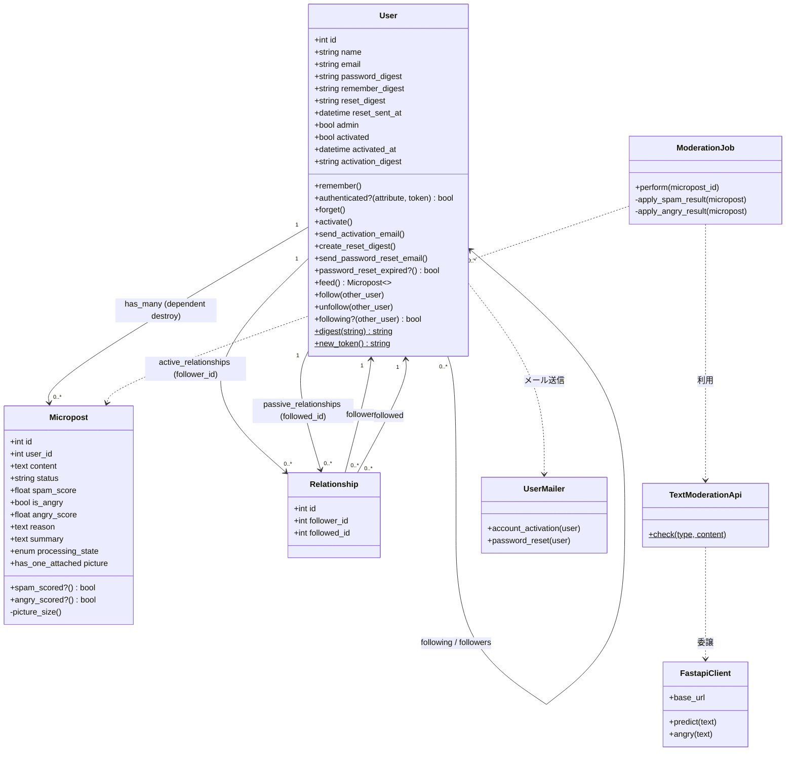
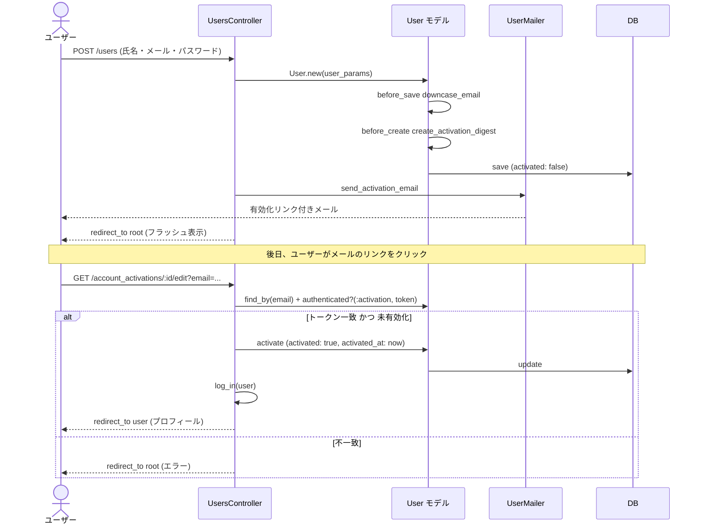
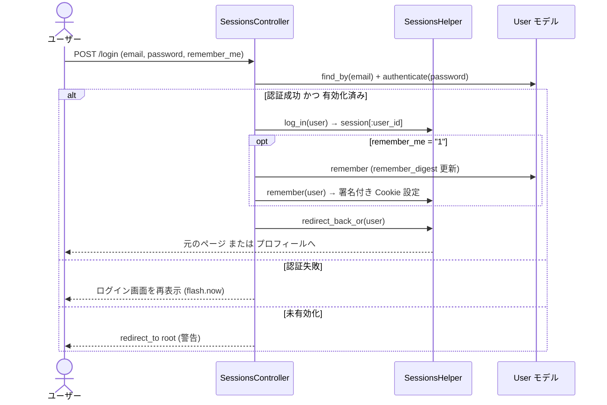
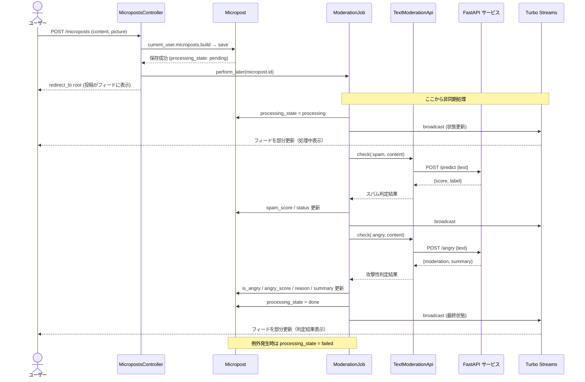
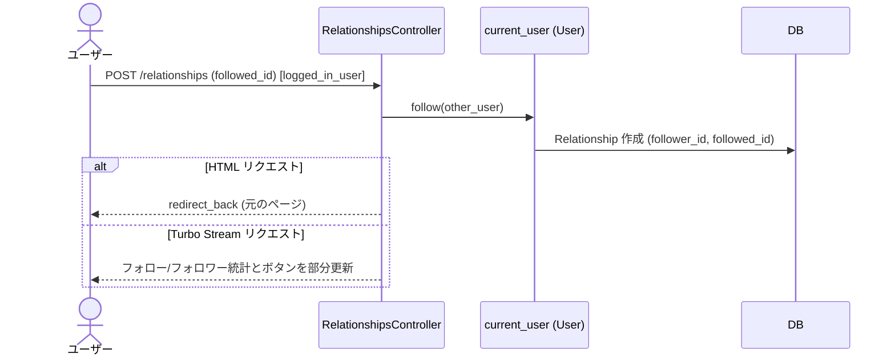
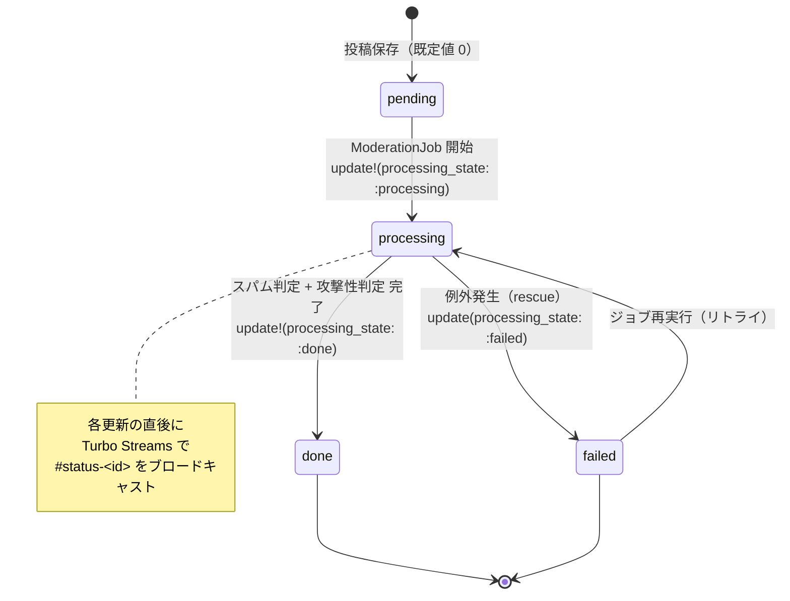
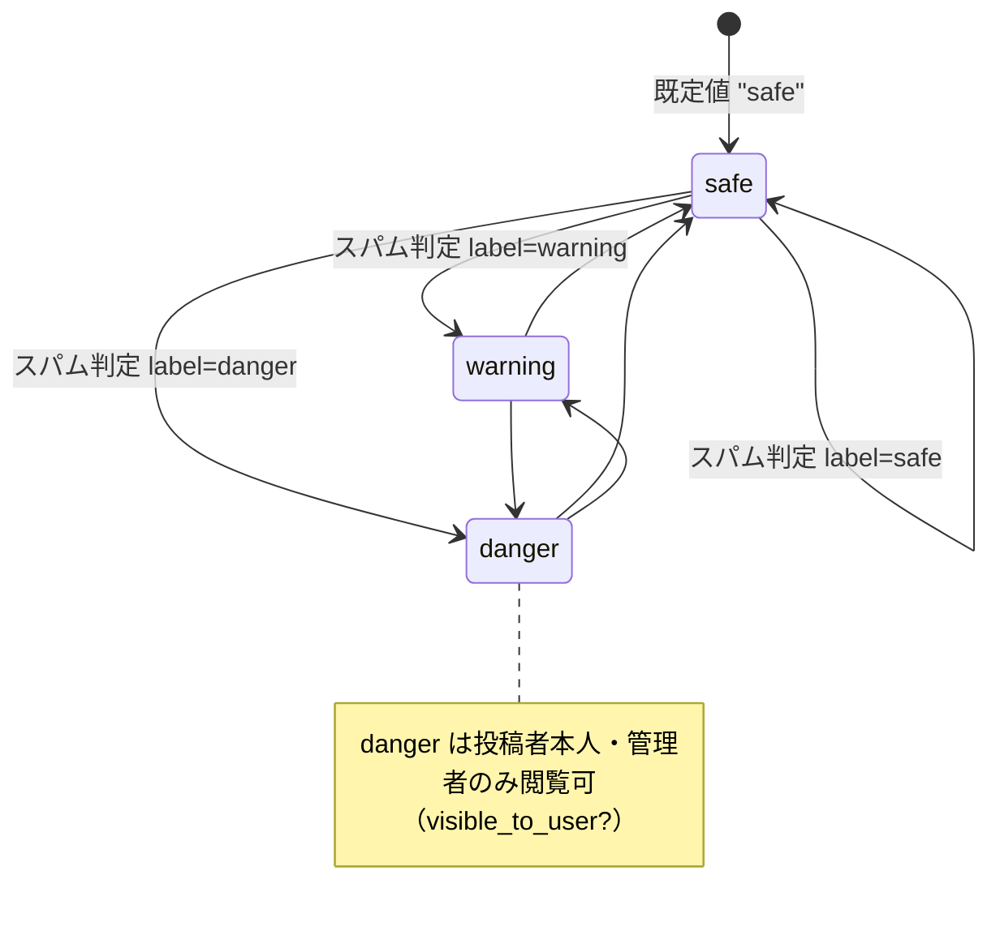

# 詳細設計書

## マイクロポストアプリ (rails-micropost-app)

---

## 1. はじめに

### 1.1 本書の目的

本書は「マイクロポストアプリ」の実装レベルの詳細設計を定義する。モデル、コントローラ、ルーティング、ヘルパー、ジョブ、メーラー、外部連携、国際化などの内部構造を記述し、開発・保守の参照資料とする。

全体像・機能要件は「[基本設計書](./basic_design.md)」を参照のこと。

### 1.2 アーキテクチャ概要

Rails 8.1 の標準的な MVC アーキテクチャに、Active Job による非同期処理と Hotwire (Turbo / Stimulus) によるリアルタイム UI を組み合わせた構成。

```
app/
├── controllers/   # リクエスト処理（7 コントローラ）
├── models/        # ドメインモデル（User / Micropost / Relationship）
├── views/         # ERB テンプレート（Bootstrap 5）
├── helpers/       # ビューヘルパー（認証・表示補助）
├── mailers/       # メール送信（UserMailer）
├── jobs/          # 非同期ジョブ（ModerationJob）
├── services/      # 外部 API クライアント（FastapiClient / TextModerationApi）
└── assets/        # SCSS / JavaScript（Importmap）
```

---

## 2. ディレクトリ・主要ファイル構成

| 分類 | パス |
| --- | --- |
| モデル | `app/models/*.rb` |
| コントローラ | `app/controllers/*_controller.rb` |
| ヘルパー | `app/helpers/*_helper.rb` |
| ビュー | `app/views/*/*.html.erb` |
| メーラー | `app/mailers/user_mailer.rb` |
| ジョブ | `app/jobs/moderation_job.rb` |
| サービス | `app/services/{fastapi_client,text_moderation_api}.rb` |
| ルーティング | `config/routes.rb` |
| スキーマ | `db/schema.rb` |
| 国際化 | `config/locales/{en,ja}.yml` |

---

## 3. データベース設計（詳細）

> ER図・全テーブルのカラム定義・制約・インデックス・enum の網羅的な定義は別冊「[DB設計書](./database_design.md)」を参照。本章は実装観点での要点を抜粋する。

### 3.1 users テーブル

| カラム | 型 | 制約・既定値 | 説明 |
| --- | --- | --- | --- |
| `id` | integer | PK | 主キー |
| `name` | string | NOT NULL | 氏名（最大 50 文字） |
| `email` | string | NOT NULL, UNIQUE | メールアドレス（最大 255 文字、小文字化保存） |
| `password_digest` | string | | bcrypt ハッシュ |
| `remember_digest` | string | | 記憶トークンのダイジェスト |
| `reset_digest` | string | | リセットトークンのダイジェスト |
| `reset_sent_at` | datetime | | リセットメール送信日時 |
| `admin` | boolean | DEFAULT false | 管理者フラグ |
| `activated` | boolean | DEFAULT false | 有効化フラグ |
| `activated_at` | datetime | | 有効化日時 |
| `activation_digest` | string | | 有効化トークンのダイジェスト |
| `created_at` / `updated_at` | datetime | NOT NULL | タイムスタンプ |

- インデックス: `email`（UNIQUE）

### 3.2 microposts テーブル

| カラム | 型 | 制約・既定値 | 説明 |
| --- | --- | --- | --- |
| `id` | integer | PK | 主キー |
| `user_id` | integer | NOT NULL, FK→users | 投稿者 |
| `content` | text | | 本文（最大 140 文字） |
| `status` | string | DEFAULT "safe" | モデレーション結果（safe / warning / danger） |
| `spam_score` | float | | スパム判定スコア |
| `is_angry` | boolean | DEFAULT false | 攻撃性検出フラグ |
| `angry_score` | float | | 攻撃性判定スコア |
| `reason` | text | | 判定理由 |
| `summary` | text | | 内容要約 |
| `processing_state` | integer | enum | 処理状態（pending:0 / processing:1 / done:2 / failed:3） |
| `created_at` / `updated_at` | datetime | NOT NULL | タイムスタンプ |

- インデックス: `[user_id, created_at]`、`user_id`
- 画像は Active Storage の `has_one_attached :picture` で関連付け

### 3.3 relationships テーブル

| カラム | 型 | 制約 | 説明 |
| --- | --- | --- | --- |
| `id` | integer | PK | 主キー |
| `follower_id` | integer | FK→users | フォローする側 |
| `followed_id` | integer | FK→users | フォローされる側 |
| `created_at` / `updated_at` | datetime | NOT NULL | タイムスタンプ |

- インデックス: `follower_id`、`followed_id`、`[follower_id, followed_id]`（UNIQUE）

### 3.4 Active Storage テーブル

`active_storage_blobs` / `active_storage_attachments` / `active_storage_variant_records` は Rails 標準のスキーマに従う。画像のメタ情報とポリモーフィックな添付関連を管理する。

---

## 4. モデル設計（詳細）

### 4.1 User モデル (`app/models/user.rb`)

#### 仮想属性

```ruby
attr_accessor :remember_token, :activation_token, :reset_token
```

#### 関連

```ruby
has_many :microposts, dependent: :destroy
has_many :active_relationships,  class_name: "Relationship",
                                 foreign_key: "follower_id", dependent: :destroy
has_many :passive_relationships, class_name: "Relationship",
                                 foreign_key: "followed_id", dependent: :destroy
has_many :following, through: :active_relationships,  source: :followed
has_many :followers, through: :passive_relationships, source: :follower
```

#### バリデーション

| 属性 | ルール |
| --- | --- |
| `name` | 存在必須、最大 50 文字 |
| `email` | 存在必須、最大 255 文字、形式チェック（正規表現）、大文字小文字を区別しない一意性 |
| `password` | `has_secure_password` により最小 6 文字、`allow_nil: true` |

#### コールバック

- `before_save :downcase_email` — メールアドレスを小文字化
- `before_create :create_activation_digest` — 有効化トークンとダイジェストを生成

#### スコープ

- `activated` — 有効化済みユーザーのみ

#### 主要メソッド

| メソッド | 説明 |
| --- | --- |
| `self.digest(string)` | bcrypt によるダイジェスト生成（コストは環境依存） |
| `self.new_token` | `SecureRandom.urlsafe_base64` によるトークン生成 |
| `remember` | 記憶トークンを生成し `remember_digest` を更新 |
| `authenticated?(attribute, token)` | 指定属性のダイジェストとトークンを照合 |
| `forget` | `remember_digest` をクリア |
| `activate` | `activated: true`、`activated_at: 現在時刻` を設定 |
| `send_activation_email` | 有効化メールを送信 |
| `create_reset_digest` | リセットトークン・ダイジェスト・送信日時を設定 |
| `send_password_reset_email` | リセットメールを送信 |
| `password_reset_expired?` | `reset_sent_at` が 2 時間以上前なら true |
| `feed` | `Micropost.where(user_id: following_ids + [id])` を返す |
| `follow(other_user)` | フォロー関係を作成 |
| `unfollow(other_user)` | フォロー関係を削除 |
| `following?(other_user)` | フォロー中なら true |

### 4.2 Micropost モデル (`app/models/micropost.rb`)

#### 関連

```ruby
belongs_to :user
has_one_attached :picture
```

#### enum

```ruby
enum :processing_state, { pending: 0, processing: 1, done: 2, failed: 3 }
```

#### バリデーション

| 属性 | ルール |
| --- | --- |
| `user_id` | 存在必須 |
| `content` | 存在必須、最大 140 文字 |
| `picture` | カスタムバリデーション `picture_size`（最大 5MB） |

#### その他

- `default_scope -> { order(created_at: :desc) }` — 新しい順
- `spam_scored?` — `spam_score` が存在すれば true
- `angry_scored?` — `angry_score` が存在すれば true
- `picture_size`（private）— 画像サイズ 5MB 超過時にエラー追加

### 4.3 Relationship モデル (`app/models/relationship.rb`)

```ruby
belongs_to :follower, class_name: "User"
belongs_to :followed, class_name: "User"

validates :follower_id, presence: true
validates :followed_id, presence: true
```

### 4.4 クラス図

ドメインモデルおよび主要な協調オブジェクト（ジョブ・サービス・メーラー）の関連を示す。



> 補足: `following` / `followers` は `Relationship` を中間テーブルとした `has_many :through` による多対多の自己参照関連。`picture` は Active Storage の `active_storage_attachments` / `active_storage_blobs` を介して関連付けられる。

---

## 5. ルーティング設計

`config/routes.rb` の定義（主要ルート）。

| HTTP メソッド | パス | コントローラ#アクション | 名前付きルート |
| --- | --- | --- | --- |
| GET | `/` | static_pages#home | root |
| GET | `/help` | static_pages#help | help |
| GET | `/about` | static_pages#about | about |
| GET | `/contact` | static_pages#contact | contact |
| GET | `/signup` | users#new | signup |
| POST | `/users` | users#create | users |
| GET | `/users` | users#index | users |
| GET | `/users/:id` | users#show | user |
| GET | `/users/:id/edit` | users#edit | edit_user |
| PATCH/PUT | `/users/:id` | users#update | user |
| DELETE | `/users/:id` | users#destroy | user |
| GET | `/users/:id/following` | users#following | following_user |
| GET | `/users/:id/followers` | users#followers | followers_user |
| GET | `/login` | sessions#new | login |
| POST | `/login` | sessions#create | login |
| DELETE | `/logout` | sessions#destroy | logout |
| GET | `/account_activations/:id/edit` | account_activations#edit | edit_account_activation |
| GET | `/password_resets/new` | password_resets#new | new_password_reset |
| POST | `/password_resets` | password_resets#create | password_resets |
| GET | `/password_resets/:id/edit` | password_resets#edit | edit_password_reset |
| PATCH/PUT | `/password_resets/:id` | password_resets#update | password_reset |
| POST | `/microposts` | microposts#create | microposts |
| DELETE | `/microposts/:id` | microposts#destroy | micropost |
| POST | `/relationships` | relationships#create | relationships |
| DELETE | `/relationships/:id` | relationships#destroy | relationship |
| GET | `/up` | rails/health#show | rails_health_check |

---

## 6. コントローラ設計（詳細）

### 6.1 ApplicationController

- `include SessionsHelper`
- `before_action :allow_browser`（モダンブラウザ制限）、`stale_when_importmap_changes`
- private `logged_in_user` — 未ログイン時はアクセス先を保存し、フラッシュ表示の上でログイン画面へリダイレクト

### 6.2 StaticPagesController

| アクション | 処理 |
| --- | --- |
| `home` | ログイン時は `@micropost` を初期化し `@feed_items`（ページング）を読み込む |
| `help` / `about` / `contact` | 各案内ページを表示 |

### 6.3 UsersController

#### before_action

```ruby
before_action :logged_in_user, only: [:index, :edit, :update, :destroy, :following, :followers]
before_action :set_user,       only: [:show, :edit, :update, :destroy, :following, :followers]
before_action :correct_user,   only: [:edit, :update]
before_action :admin_user,     only: [:destroy]
```

#### アクション

| アクション | 処理 |
| --- | --- |
| `new` | 登録フォーム表示 |
| `create` | ユーザー作成 → 有効化メール送信 → ルートへリダイレクト |
| `show` | 有効化済みユーザーの情報と投稿一覧（ページング）を表示 |
| `edit` | 編集フォーム表示 |
| `update` | プロフィール更新 → 詳細画面へ |
| `index` | `User.activated.paginate(page: params[:page])` を一覧表示 |
| `destroy` | ユーザー削除 → 一覧へ |
| `following` | フォロー中ユーザー一覧（`show_follow` を描画） |
| `followers` | フォロワー一覧（`show_follow` を描画） |

- `user_params` — `:name, :email, :password, :password_confirmation` を許可
- `correct_user` — 本人以外はルートへリダイレクト
- `admin_user` — 管理者以外はルートへリダイレクト

### 6.4 SessionsController

| アクション | 処理 |
| --- | --- |
| `new` | ログインフォーム表示 |
| `create` | 認証 → 有効化済みなら `log_in`、`remember_me` 指定時は `remember` → フレンドリーフォワーディング |
| `destroy` | `log_out` してルートへ |

### 6.5 AccountActivationsController

| アクション | 処理 |
| --- | --- |
| `edit` | メールで対象ユーザーを特定し、未有効化かつトークンが一致すれば `activate` → ログイン → 詳細画面へ |

### 6.6 PasswordResetsController

#### before_action

```ruby
before_action :get_user,         only: [:edit, :update]
before_action :valid_user,       only: [:edit, :update]
before_action :check_expiration, only: [:edit, :update]
```

| アクション | 処理 |
| --- | --- |
| `new` | リセット要求フォーム表示 |
| `create` | 対象ユーザーに `create_reset_digest` → メール送信 |
| `edit` | 再設定フォーム表示 |
| `update` | パスワード空チェック → 更新 → ログイン → `reset_digest` クリア |

- `valid_user` — ユーザー存在・有効化済み・トークン一致を検証
- `check_expiration` — `password_reset_expired?` なら要求画面へ戻す

### 6.7 MicropostsController

```ruby
before_action :logged_in_user, only: [:create, :destroy]
before_action :correct_user,   only: [:destroy]
```

| アクション | 処理 |
| --- | --- |
| `create` | `current_user.microposts.build` → 保存 → `ModerationJob` をエンキュー → ルートへ |
| `destroy` | 投稿削除 → 元のページまたはルートへ |

- `micropost_params` — `:content, :picture` を許可
- `correct_user` — `current_user.microposts` から対象を取得（他人の投稿は削除不可）

### 6.8 RelationshipsController

```ruby
before_action :logged_in_user
```

| アクション | 処理 |
| --- | --- |
| `create` | `params[:followed_id]` のユーザーを `follow`、HTML / JS に応答 |
| `destroy` | `params[:id]` の関係を取得し `unfollow`、HTML / JS に応答 |

---

## 7. 非同期処理・外部連携

### 7.1 ModerationJob (`app/jobs/moderation_job.rb`)

`MicropostsController#create` から `perform_later(micropost_id)` で起動される。

処理フロー:

1. 対象投稿の `processing_state` を `:processing` に更新し、Turbo Streams で `"microposts"` チャネルへ状態をブロードキャスト。
2. `apply_spam_result` — `TextModerationApi.check(:spam, content)` を呼び、`spam_score` と `status` を更新。
3. 状態をブロードキャスト。
4. `apply_angry_result` — `TextModerationApi.check(:angry, content)` を呼び、`is_angry` / `angry_score` / `reason` / `summary` を更新。
5. `processing_state` を `:done` に更新し、最終状態をブロードキャスト。
6. 例外発生時は `processing_state` を `:failed` に設定。

### 7.2 TextModerationApi (`app/services/text_moderation_api.rb`)

- モデレーション種別（`:spam` / `:angry`）に応じて `FastapiClient` を呼び分けるサービス層。

### 7.3 FastapiClient (`app/services/fastapi_client.rb`)

- 外部 FastAPI サービス（既定 `http://127.0.0.1:8000`）へ HTTP リクエストを送る低レベルクライアント。

| エンドポイント | メソッド | リクエスト | レスポンス |
| --- | --- | --- | --- |
| `/predict` | POST | `{ text: "本文" }` | `{ score, label }`（スパム判定） |
| `/angry` | POST | `{ text: "本文" }` | `{ moderation: { is_angry, score, reason }, summary }`（攻撃性判定） |

---

## 8. メーラー設計

### 8.1 UserMailer (`app/mailers/user_mailer.rb`)

| メソッド | 件名（i18n キー） | テンプレート |
| --- | --- | --- |
| `account_activation(user)` | `user_mailer.account_activation.subject` | `account_activation.{html,text}.erb` |
| `password_reset(user)` | `user_mailer.password_reset.subject` | `password_reset.{html,text}.erb` |

- 各メソッドは `@user` をテンプレートへ渡す。
- 開発環境の配信方式は `:test`、URL ホストは `localhost:3000`。

---

## 9. ヘルパー設計

### 9.1 SessionsHelper (`app/helpers/sessions_helper.rb`)

| メソッド | 説明 |
| --- | --- |
| `log_in(user)` | `session[:user_id]` を設定 |
| `remember(user)` | 記憶トークンを生成し署名付き Cookie とトークン Cookie を設定 |
| `current_user` | セッションまたは永続 Cookie からユーザーを取得（トークン照合あり） |
| `current_user?(user)` | 現在のユーザーか判定 |
| `logged_in?` | ログイン状態か判定 |
| `forget(user)` | トークンと Cookie をクリア |
| `log_out` | ユーザーを忘れてセッションをクリア |
| `store_location` | GET リクエスト時に `request.original_url` を保存 |
| `redirect_back_or(default)` | 保存先または既定 URL へリダイレクト |

### 9.2 ApplicationHelper

- `full_title(page_title = "")` — `"<ページ名> | <ベースタイトル>"` を生成。

### 9.3 UsersHelper

- `gravatar_for(user, options = { size: 80 })` — メールアドレスの MD5 ハッシュから Gravatar URL を生成。

### 9.4 MicropostsHelper

| メソッド | 説明 |
| --- | --- |
| `visible_to_user?(post, current_user)` | 管理者・投稿者は常に true、それ以外は `status != "danger"` のとき true |
| `spam_score_percentage(score)` | スコアをパーセント表記に変換（空なら nil） |
| `micropost_status_label(status)` | ステータスに対応する絵文字付きラベル（✅安全 / ⚠️注意 / 🚨危険） |
| `micropost_status_class(status)` | ステータスに対応する CSS クラス（text-success / text-warning / text-danger） |

---

## 10. ビュー設計

### 10.1 レイアウト

| ファイル | 役割 |
| --- | --- |
| `layouts/application.html.erb` | メインレイアウト |
| `layouts/_head.html.erb` | head セクション（メタ・スタイル） |
| `layouts/_header.html.erb` | ナビゲーションバー |
| `layouts/_footer.html.erb` | フッター |
| `layouts/mailer.{html,text}.erb` | メール用レイアウト |

### 10.2 主要ビュー・パーシャル

| ファイル | 役割 |
| --- | --- |
| `static_pages/home.html.erb` | ログイン状態で `_logged_in_home` / `_logged_out_home` を出し分け |
| `static_pages/_logged_in_home.html.erb` | ダッシュボード（ユーザー情報・統計・投稿フォーム・フィード） |
| `users/{new,edit,show,index,show_follow}.html.erb` | ユーザー関連画面 |
| `users/_form.html.erb` | ユーザーフォーム共通パーシャル |
| `users/_follow.html.erb` / `_unfollow.html.erb` / `_follow_form.html.erb` | フォロー操作 |
| `sessions/new.html.erb` | ログインフォーム |
| `password_resets/{new,edit}.html.erb` | パスワードリセット画面 |
| `microposts/_micropost.html.erb` | 投稿表示（`visible_to_user?` による可視性制御） |
| `microposts/_poststatus.html.erb` | モデレーション状態表示 |
| `shared/_feed.html.erb` | フィード（`turbo_stream_from`、ページング） |
| `shared/_micropost_form.html.erb` | 投稿フォーム（クライアント側 5MB チェック） |
| `shared/_error_messages.html.erb` | フォームエラー表示 |
| `shared/_user_info.html.erb` / `_stats.html.erb` | サイドバー・統計 |

### 10.3 リアルタイム更新

- フィードは `turbo_stream_from "microposts"` で購読し、`ModerationJob` のブロードキャストにより投稿状態をリアルタイム更新する。

---

## 11. フロントエンド

| 項目 | 内容 |
| --- | --- |
| CSS | Bootstrap 5.3.8（dartsass-rails でコンパイル）、カスタム SCSS |
| JS モジュール管理 | Importmap（ES モジュール） |
| インタラクション | Hotwire（Turbo によるページ高速化、Stimulus） |
| クライアント検証 | 投稿フォームで画像 5MB 超過を事前チェック |

---

## 12. 国際化（i18n）

### 12.1 設定（`config/application.rb`）

```ruby
config.i18n.available_locales = [:en, :ja]
config.i18n.default_locale    = :ja
config.i18n.fallbacks         = [:en]
```

### 12.2 ロケールファイル構成

- `config/locales/en.yml`、`config/locales/ja.yml`
- 主なセクション: `app`、`flash`、`helpers`、`navigation`、`static_pages`、`users`、`sessions`、`password_resets`、`microposts`、`shared`、`footer`、`user_mailer`
- `ja.yml` には加えて `activerecord`（モデル名・属性名）、`errors`（バリデーションメッセージ）、`datetime.distance_in_words`、`will_paginate` の翻訳を含む。

---

## 13. 認証・認可フロー（詳細）

### 13.1 認証方式

- `has_secure_password`（bcrypt）によるパスワード照合。
- 永続化方式は 2 通り:
  1. セッション: `session[:user_id]`（ブラウザ終了で破棄）
  2. Cookie: `cookies.permanent.signed[:user_id]` + `cookies.permanent[:remember_token]`（記憶トークン照合あり）

### 13.2 トークン

| 用途 | 仮想属性 | 永続化カラム | 生成方法 |
| --- | --- | --- | --- |
| 有効化 | `activation_token` | `activation_digest` | `SecureRandom.urlsafe_base64` + bcrypt |
| リセット | `reset_token` | `reset_digest` | 同上 |
| 記憶 | `remember_token` | `remember_digest` | 同上 |

### 13.3 認可制御

| フィルタ | 適用先 | 内容 |
| --- | --- | --- |
| `logged_in_user` | 保護アクション全般 | 未ログイン時はログイン画面へ |
| `correct_user` | プロフィール編集・投稿削除 | 本人以外を拒否 |
| `admin_user` | ユーザー削除 | 管理者以外を拒否 |
| `visible_to_user?` | 投稿表示 | `danger` 投稿は投稿者・管理者のみ閲覧可 |

---

## 14. シーケンス図

主要なユースケースの処理フローを示す。

### 14.1 ユーザー登録〜アカウント有効化



### 14.2 ログイン（ログイン状態の保持あり）



### 14.3 マイクロポスト投稿とモデレーション（非同期 + リアルタイム更新）



### 14.4 フォロー（Turbo による部分更新）



---

## 15. 状態遷移図

### 15.1 マイクロポストの処理状態（processing_state）

投稿のモデレーション処理状態は `enum :processing_state` で管理され、`ModerationJob` の進行に従って遷移する。



| 状態 | 値 | 遷移契機 | UI表示（_poststatus） |
| --- | --- | --- | --- |
| `pending` | 0 | 投稿保存直後の初期値 | （ジョブ起動待ち） |
| `processing` | 1 | `ModerationJob#perform` 開始時 | ⏳ スパム判定中… / 怒り判定中… |
| `done` | 2 | スパム・攻撃性の両判定完了時 | 判定結果（✅/⚠️/🚨 + 各スコア） |
| `failed` | 3 | 処理中に例外発生（`rescue` 節） | 失敗表示 |

### 15.2 投稿の判定ステータス（status）

`status` はスパム判定 API のラベル（`result["label"]`）により設定され、表示・可視性制御に用いる。



> `status` は再判定（ジョブ再実行）のたびに最新のスパム判定ラベルで上書きされる。値は `safe` / `warning` / `danger` の3種。

---

## 16. API仕様

本システムは画面遷移型（サーバサイドレンダリング + Hotwire）のWebアプリであり、外部公開のRESTful JSON APIは持たない。インターフェースは次の3種に大別される。

### 16.1 内部HTTPエンドポイント（ブラウザ ↔ Rails）

リクエストはHTMLフォーム／Turboによる送信、レスポンスはHTML描画またはリダイレクト（一部 Turbo Stream）。全ルートは「[第5章 ルーティング設計](#5-ルーティング設計)」を参照。主要な更新系エンドポイントの入出力仕様を以下に示す。

| エンドポイント | メソッド | 主なリクエストパラメータ | 認可 | 正常時レスポンス | 異常時 |
| --- | --- | --- | --- | --- | --- |
| `/users` | POST | `user[name]`, `user[email]`, `user[password]`, `user[password_confirmation]` | 不要 | 302 → `/`（有効化メール送信） | 422 相当：`new` 再描画（エラー表示） |
| `/login` | POST | `session[email]`, `session[password]`, `session[remember_me]` | 不要 | 302 → 元ページ or プロフィール | `new` 再描画 / 未有効化は `/` へ |
| `/microposts` | POST | `micropost[content]`, `micropost[picture]`（multipart） | ログイン必須 | 302 → `/`（`ModerationJob` 起動） | `home` 再描画（エラー表示） |
| `/microposts/:id` | DELETE | — | 本人のみ | 303 → 元ページへ戻る（Turbo） | 本人以外は `/` へ |
| `/relationships` | POST | `followed_id` | ログイン必須 | HTML: 302 リダイレクト / Turbo Stream: 部分更新 | `/login` へ |
| `/relationships/:id` | DELETE | — | ログイン必須 | HTML: 303 リダイレクト / Turbo Stream: 部分更新 | `/login` へ |
| `/password_resets` | POST | `password_reset[email]` | 不要 | 302 → `/`（リセットメール送信） | `new` 再描画 |
| `/password_resets/:id` | PATCH | `user[password]`, `user[password_confirmation]`、`email`（クエリ） | トークン検証 | 303 → プロフィール | `edit` 再描画 / 期限切れは要求画面へ |
| `/account_activations/:id/edit` | GET | `email`（クエリ） | トークン検証 | 302 → プロフィール（自動ログイン） | `/` へ |
| `/up` | GET | — | 不要 | 200（正常）/ 500（異常） | — |

> **302 と 303 について**：データを変更する操作は PRG（Post/Redirect/Get）パターンに従い、処理後に別ページへリダイレクトする。`POST`（作成）系は `302 Found`、`DELETE`/`PATCH`（削除・更新）系は `303 See Other` を返す。303 は「リダイレクト先を必ず GET で取得せよ」と仕様で明確に定められており、Turbo（Hotwire）が `DELETE`/`PATCH` のリダイレクト先へ誤って同じメソッドで再アクセスするのを防ぐため、該当コントローラでは `redirect_to ..., status: :see_other` を指定している。

### 16.2 外部API（Rails ↔ テキストモデレーションAPI）

`FastapiClient`（`Net::HTTP`）経由でFastAPIサービスを呼び出す。`TextModerationApi.check(type, text)` がエンドポイントを振り分ける。

**共通仕様**

| 項目 | 内容 |
| --- | --- |
| ベースURL | `http://127.0.0.1:8000`（`FastapiClient::BASE_URL` にハードコード） |
| メソッド | POST |
| リクエストヘッダ | `Content-Type: application/json`、`Accept: application/json` |
| リクエストボディ | `{ "text": "<投稿本文>" }` |
| レスポンス解析 | `JSON.parse(response.body)` |
| 呼び出し元 | `ModerationJob`（非同期） |

**(A) スパム判定 `POST /predict`**

リクエスト:
```json
{ "text": "投稿本文" }
```

レスポンス（期待スキーマ）:
```json
{ "score": 0.87, "label": "danger" }
```

| フィールド | 型 | マッピング先 |
| --- | --- | --- |
| `score` | float | `micropost.spam_score` |
| `label` | string | `micropost.status`（`safe`/`warning`/`danger`） |

**(B) 攻撃性判定 `POST /angry`**

リクエスト:
```json
{ "text": "投稿本文" }
```

レスポンス（期待スキーマ）:
```json
{
  "moderation": { "is_angry": true, "score": 0.92, "reason": "判定理由" },
  "summary": "内容の要約"
}
```

| フィールド | 型 | マッピング先 |
| --- | --- | --- |
| `moderation.is_angry` | boolean | `micropost.is_angry` |
| `moderation.score` | float | `micropost.angry_score` |
| `moderation.reason` | string | `micropost.reason` |
| `summary` | string | `micropost.summary` |

> **現状の制約（要改善点）**: `FastapiClient` はタイムアウト・リトライ・HTTPステータスチェックを実装していない。接続失敗やJSON不正時は例外となり、`ModerationJob` の `rescue` で投稿が `failed` 状態になる（詳細は[第17章](#17-エラーハンドリング戦略)）。本番運用では接続先のURL外部化（環境変数化）、タイムアウト設定、認証の追加が必要。

### 16.3 リアルタイム配信（Rails → ブラウザ / Turbo Streams）

| 項目 | 内容 |
| --- | --- |
| チャネル | `Turbo::StreamsChannel`、ストリーム名 `"microposts"` |
| 購読側 | `shared/_feed.html.erb` の `turbo_stream_from "microposts"` |
| 配信契機 | `ModerationJob#broadcast`（状態更新のたび） |
| 配信方式 | `broadcast_replace_to`（`target: "status-<id>"`、`partial: "microposts/poststatus"`） |
| 基盤 | 開発: `async` / 本番: Solid Cable |

---

## 17. エラーハンドリング戦略

レイヤごとにエラーの捕捉方法とユーザーへの応答を定義する。

### 17.1 レイヤ別方針

| レイヤ | エラー種別 | 捕捉・処理 | ユーザーへの応答 |
| --- | --- | --- | --- |
| 入力検証 | バリデーション失敗 | モデルの `errors` を `shared/_error_messages` で描画 | フォーム再描画 + エラー一覧 |
| 認証 | 未ログインで保護ページへアクセス | `logged_in_user` が `store_location` 後リダイレクト | フラッシュ（danger）+ `/login` へ |
| 認可 | 本人外/管理者外の操作 | `correct_user` / `admin_user` がリダイレクト | `/` へリダイレクト |
| トークン検証 | 有効化・リセットトークン不一致／期限切れ | `valid_user` / `check_expiration` がリダイレクト | フラッシュ + 該当画面へ |
| ルーティング/DB | `ActiveRecord::RecordNotFound` 等 | 本番は Rails 標準の例外ハンドラ | 404/500 エラーページ |
| 非同期ジョブ | 処理中の例外 | `ModerationJob` の `rescue` で `failed` 化後に `raise`（再送出） | フィードに失敗状態を表示 |
| 外部API | 接続失敗・タイムアウト・不正JSON | （現状）ジョブ内で例外 → `failed` 状態 | 投稿自体は保存・表示を継続 |

### 17.2 非同期ジョブの異常時フロー

```ruby
def perform(micropost_id)
  micropost = Micropost.find(micropost_id)
  micropost.update!(processing_state: :processing)
  # ... 判定処理 ...
  micropost.update!(processing_state: :done)
rescue => e
  micropost&.update(processing_state: :failed)
  raise e   # 再送出 → Active Job のリトライ機構に委ねる
end
```

- 例外時は投稿を `failed` に更新したうえで例外を再送出し、Webリクエスト（投稿操作）には影響させない。
- 外部API障害が発生しても**投稿の保存・表示は継続**する（可用性を優先）。判定結果のみが欠落する。

### 17.3 改善推奨事項

| 項目 | 現状 | 推奨 |
| --- | --- | --- |
| リトライ制御 | `ApplicationJob` 既定（明示設定なし） | `retry_on`（外部API起因の一時障害）／`discard_on`（`RecordNotFound`）の明示 |
| タイムアウト | 未設定 | `Net::HTTP` の `open_timeout` / `read_timeout` 設定 |
| HTTPステータス確認 | 未確認（200前提で `JSON.parse`） | 非2xx時の分岐・ログ出力 |
| 失敗投稿の救済 | 手動再実行 | 失敗ジョブの再投入導線・通知 |

---

## 18. パフォーマンス・インデックス設計

### 18.1 インデックス設計

クエリパターンに対応したインデックスを付与している（定義は「[DB設計書 第4章](./database_design.md#4-制約インデックス一覧)」参照）。設計意図は以下のとおり。

| インデックス | 対象 | 目的・効くクエリ |
| --- | --- | --- |
| `index_users_on_email`（UNIQUE） | `users.email` | ログイン時の `find_by(email:)`、一意性保証 |
| `index_microposts_on_user_id_and_created_at` | `microposts[user_id, created_at]` | プロフィール投稿一覧・フィード取得（`user_id` 絞り込み + `created_at DESC` 並び替え）を単一インデックスで充足 |
| `index_microposts_on_user_id` | `microposts.user_id` | 外部キー結合・件数集計 |
| `index_relationships_on_follower_id_and_followed_id`（UNIQUE） | `relationships[follower_id, followed_id]` | 重複フォロー防止、`following?` 判定 |
| `index_relationships_on_follower_id` / `_on_followed_id` | 各FK | フォロー中・フォロワー一覧の取得 |

### 18.2 パフォーマンス計画

| 観点 | 方針 |
| --- | --- |
| 投稿レスポンス | AI判定を `ModerationJob`（非同期）に分離し、投稿操作は保存＋リダイレクトのみ（体感応答を阻害しない） |
| 一覧表示 | `will_paginate` で全一覧（ユーザー・投稿・フィード・フォロー）をページング（既定 30 件/ページ） |
| フィード取得 | `Micropost.where(user_id: following_ids + [id])` を複合インデックスで取得 |
| キャッシュ | Solid Cache をキャッシュストアに採用 |
| 静的配信 | 本番は Thruster によるアセットキャッシュ・圧縮、`X-Sendfile` |
| スケール | ジョブ増大時は Solid Queue ワーカー追加で水平スケール（DBはSQLiteのため単一ノード前提） |

### 18.3 既知の性能リスク

| リスク | 内容 | 対応案 |
| --- | --- | --- |
| N+1クエリ | フィード・一覧での `user` / 添付画像参照 | `includes(:user, picture_attachment: :blob)` の付与 |
| Gravatar | 外部画像の都度参照 | ブラウザキャッシュに依存（必要に応じCDN化） |
| SQLite書込み競合 | 高負荷時の書込みロック | 本番DBのPostgreSQL等への移行検討 |

---

## 19. 設定・環境構築

### 19.1 前提ソフトウェア

| 項目 | バージョン / 内容 |
| --- | --- |
| Ruby | 3.3.11 |
| Rails | 8.1.3 |
| データベース | SQLite 3 |
| Node 等 | 不要（Importmap によりビルド工程なし） |
| 外部API | テキストモデレーションAPI（FastAPI / Uvicorn）を `127.0.0.1:8000` で別途起動 |

### 19.2 開発環境の構築手順

```bash
# 1. 依存gemのインストール
bundle install

# 2. データベースの作成・マイグレーション
bin/rails db:create db:migrate

# 3. 初期データ（サンプルユーザー・投稿・フォロー）の投入
bin/rails db:seed

# 4. アプリケーションの起動
bin/rails server   # http://localhost:3000

# 5. （別プロセス）モデレーションAPIを 127.0.0.1:8000 で起動
#    ※ 起動していない場合、投稿は保存されるが判定は failed となる
```

### 19.3 主要設定値

| 区分 | 設定項目 | 値 / 参照 |
| --- | --- | --- |
| ロケール | 既定 / 対応 / フォールバック | `:ja` / `[:en, :ja]` / `[:en]`（`config/application.rb`） |
| メール | 配信方式（開発） | `:test`、`default_url_options = { host: "localhost", port: 3000 }` |
| ジョブ | キューアダプタ | 開発: `:async` / 本番: Solid Queue |
| リアルタイム | Action Cable | 開発: `async` / 本番: Solid Cable |
| キャッシュ | ストア | Solid Cache |
| 外部API | 接続先URL | `FastapiClient::BASE_URL = "http://127.0.0.1:8000"`（**ハードコード**。要環境変数化） |
| パスワードリセット | 有効期限 | 2時間（`password_reset_expired?`） |
| 永続ログイン | Cookie | `cookies.permanent`（約20年） |
| 投稿 | 文字数 / 画像サイズ | 最大140文字 / 最大5MB |
| ページング | 1ページ件数 | will_paginate 既定 30 件 |

### 19.4 環境変数・機密情報

| 項目 | 管理方法 |
| --- | --- |
| 機密情報 | `config/credentials.yml.enc`（`RAILS_MASTER_KEY` で復号） |
| デプロイ秘匿値 | `.kamal/secrets` |
| Puma 関連 | `WEB_CONCURRENCY`、`SOLID_QUEUE_IN_PUMA`、`PIDFILE` 等（`config/puma.rb`） |

### 19.5 本番デプロイ

- Docker イメージ（`Dockerfile`）を Kamal（`config/deploy.yml`）でデプロイ。
- kamal-proxy が TLS 終端（Let's Encrypt）、Thruster がアセット配信を担う。
- 詳細なインフラ構成は「[基本設計書 1-1〜1-3](./basic_design.md)」を参照。

---

## 20. テスト方針・テストケース

### 20.1 テスト方針

| 種別 | ツール | 対象 |
| --- | --- | --- |
| 単体・統合テスト | Minitest（minitest-reporters） | モデル・コントローラ・ヘルパー・メーラー |
| システムテスト | Capybara + Selenium | ブラウザ操作を伴う E2E |
| 継続実行 | Guard（guard-minitest） | ファイル変更検知による自動テスト |
| セキュリティ | Brakeman / bundler-audit | 静的解析・依存脆弱性検査 |

### 20.2 既存テスト構成（`test/` 配下）

| 分類 | テストファイル | 主な検証観点 |
| --- | --- | --- |
| モデル | `models/user_test.rb` | バリデーション、認証、`feed`、フォロー、ダイジェスト |
| モデル | `models/micropost_test.rb` | 本文・画像バリデーション、並び順 |
| モデル | `models/relationship_test.rb` | フォロー関係の妥当性 |
| コントローラ | `controllers/*_controller_test.rb` | 各アクションの認可・リダイレクト・ステータス |
| 統合 | `integration/users_signup_test.rb` | 登録〜有効化フロー |
| 統合 | `integration/users_login_test.rb` | ログイン / ログイン保持 / ログアウト |
| 統合 | `integration/password_resets_test.rb` | リセット要求〜再設定・期限切れ |
| 統合 | `integration/microposts_interface_test.rb` | 投稿作成・削除・ページング |
| 統合 | `integration/following_test.rb` | フォロー / フォロワーUI |
| 統合 | `integration/users_edit_test.rb` / `users_index_test.rb` / `users_profile_test.rb` / `site_layout_test.rb` | 編集・一覧・プロフィール・レイアウト |
| メーラー | `mailers/user_mailer_test.rb` | 有効化・リセットメールの内容 |
| ヘルパー | `helpers/*_test.rb` | `full_title`、セッション補助 |

### 20.3 主要テストケース観点

| ID | 機能 | テスト観点 | 期待結果 |
| --- | --- | --- | --- |
| T-01 | ユーザー登録 | 無効な入力（空・形式不正・確認不一致） | 登録不可、エラー表示 |
| T-02 | ユーザー登録 | 有効な入力 | 登録成功、有効化メール送信、未有効化状態 |
| T-03 | アカウント有効化 | 不正トークン / 正トークン | 不一致は失敗、正は有効化+ログイン |
| T-04 | ログイン | 誤った認証情報 / 未有効化 / 正常 | 失敗フラッシュ / `/` へ / ログイン成功 |
| T-05 | ログイン保持 | remember_me あり/なし | Cookie 設定有無の差 |
| T-06 | パスワードリセット | 期限切れリンク | 再設定不可、要求画面へ |
| T-07 | 投稿 | 140字超 / 画像5MB超 / 正常 | 失敗 / 失敗 / 成功 + ジョブ起動 |
| T-08 | 投稿削除 | 他人の投稿削除 | 不可（`/` へ） |
| T-09 | 認可 | 未ログインで保護ページ | `/login` へ誘導 + フォワーディング |
| T-10 | 認可 | 非管理者がユーザー削除 | 不可（`/` へ） |
| T-11 | フォロー | フォロー / 解除 | 統計・関係の増減 |
| T-12 | 可視性 | `danger` 投稿の他者閲覧 | 非表示（本人・管理者は可視） |
| T-13 | モデレーション | ジョブ実行で状態遷移 | pending→processing→done、結果反映 |

---

## 21. 関連ドキュメント

- [基本設計書](./basic_design.md)
- [DB設計書](./database_design.md)
- [要件定義書](./requirements_definition.md)
